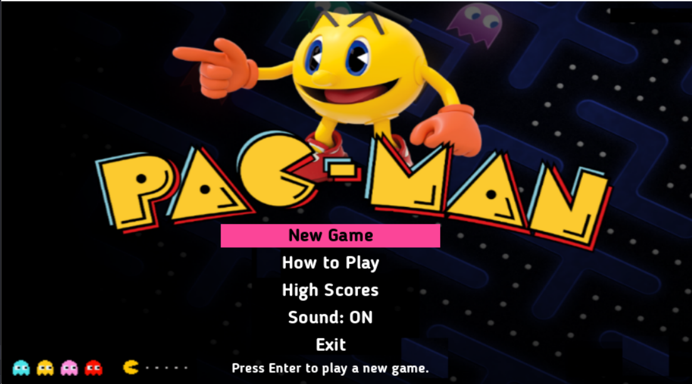
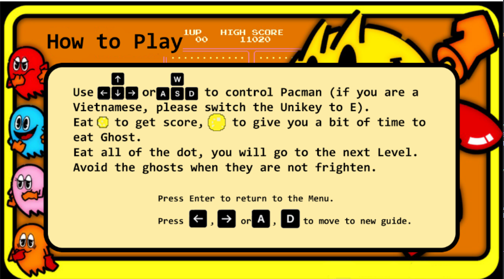
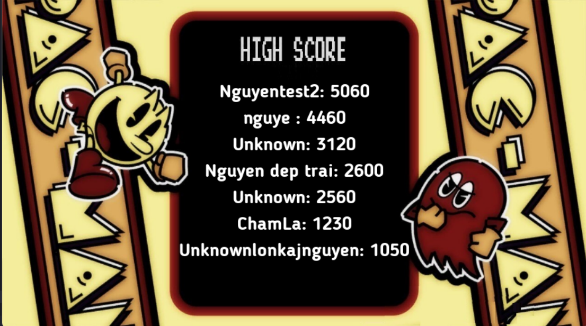
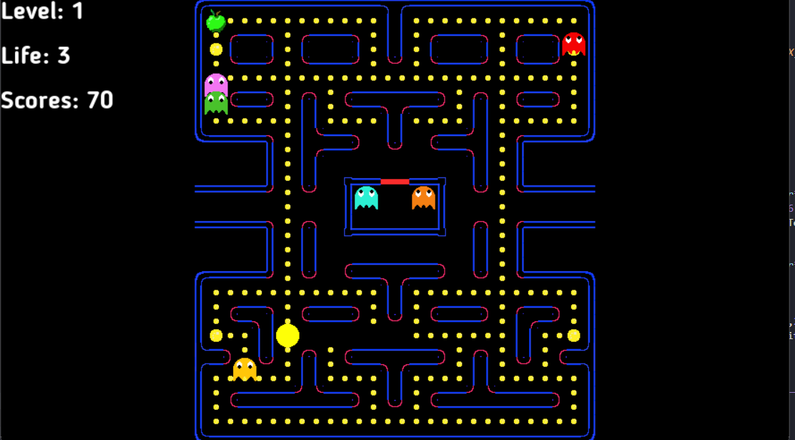
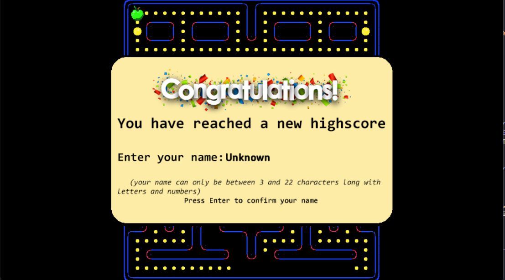
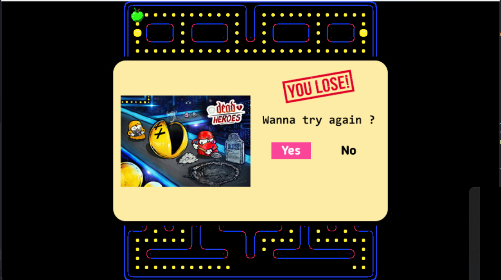

# **PACMAN-replica**

## Table of content
1. [How to Download and install](#How-to-Download-and-Install)
2. [How to Play the game](#How-to-play-the-game)
3. [Game detail](#Game-detail)
4. [Game algorithm](#Game-algorithm) 
5. [Image and Sound source](#Image-and-Sound-source)

### Contents
1. ### How to Download and Install
    Follow the instruction on these links to install \
        - [SDL 2.0](https://www.libsdl.org/download-2.0.php)  
        - [SDL_image](https://www.libsdl.org/projects/SDL_image/)  
        - [SDL_mixer](https://www.libsdl.org/projects/SDL_mixer/)  
        - [SDL_ttf](https://www.libsdl.org/projects/SDL_ttf/)  

    Clonde project and run "main" command in the file containing main.exe by using cmd

2. ### How to play the game
 
    Control a character named `Pacman` . Your mission is eating all the `dot` 
    Using `W` `A` `S` `D` or navigation arrows to control `Pacman`.
    
    Prevent you from eating is 6 Ghosts: `Blinky`, `Pinky`, `Clyde`, `Inky`, `Greendy`, `Friendy`. 

    Eat Powerdot  You will have all small time to hunt the Ghosts. Eating the scared Ghosts gives you lots of score, also make them return to th cage.
3. ### Game detail

    The game is the maze with 28x31 tiles. There are total 244 dots. 240 normai dots ans 4 powerdots.

    About the Ghosts, each ong of them has their own AI. That means each ghost behaves differently.

    #### `Chase`
    - [`Blinky`]() : chasing `Pacman`.   
    - [`Pinky`]() : go to the 4 tiles in front of `Pacman` direction.
    - [`Inky`]() : go to the location created by `Blinky`  symmetry across the `Pacman`.
    - [`Clyde`]() : chase `Pacman` if the distance between him and `Pacman` is grater then 8 tiles.
     - `Greendy` Like his name, his skills is green and he like apple. In the game,  a green apple is spawn randomly at 1 of 4 corner. if greendy is out of cage, he will go finding the apple. After eating, he wil gain x2 speed in 2s, start hunting Pacman. You should becareful with him.  `Greendy` can be scared and eaten.
    - `Friendy` : This one is spacial. Her skin is yellow, like `Pacman`. She is someone who cares about friends(of course, freind here is ghosts). Shw will randomly on maze.But if you eat `power dot`, she wil not be effect. Instead, she will hunting `Pacman` in 3s. 

    #### `Scatter`
    In scatter mode, the first 4 Ghosts, each one has its own corner. They will go around the corner for a few seconds.

    #### `Frighten`    
    In frighten mode, except `Friendly`, the ghosts turn blue  and `Pacman` will be able to eat them for a few seconds.

    if you eat a ghost in this mode, it will trun into `ghost'eyes` , find the way and get back to the in front of the cage then respawn.

    The three modes above chage alternately. More information: https://pacman.fandom.com/wiki/Maze_Ghost_AI_Behaviors  

    Here are some pictures of the game.\
     
4. ### Game algorithm
    -------------------------------
    Firstly, let's talk about the algorithm for the ghosts to chase `Pacman`.

    The ghosts have several properties as follows: 
    - `tileX`: current tile position on Ox axis. 
    - `tileY`: current tile position on Oy axis.
    - `scrPosX`: current screen position on Ox axis. 
    - `scrPosY`: current screen position on Oy axis. 
    - `nextTile (X, Y)`: coordinates of the destination tile.  
    
    In the original game, developers manage positions using tiles. However, I manage them using screen positions. When a ghost steps into a new tile, i have to find the best path to reach the destination. There are three directions to choose from (if the direction is a wall, i won't count it): `forward`, `turn 90 degrees clockwise`, and `turn 90 degrees counterclockwise`. I use BFS to calculate how many steps it takes to get from one tile to another, with the condition that at each step, the ghost cannot turn back against its previous direction. I calculate BFS before you click 'new game', so it won't lag.
    
    Describe BFS in map.cpp:
    - Lines 1 and 2 declare 2 arrays of integers dx and dy to represent 4 directions of movement.
    - Line 4 sets the default value of -1 for the dist array. This array is used to store the distance between two points on the matrix.
    - Line 6 declares a queue to be of type std::tuple<int, int, int>. The 3 integers in the tuple are the x coordinate, y coordinate and the direction of movement, respectively.
    - Line 7 marks as unvisited each cell on the matrix using the array visited.
    - Lines 8-27 will traverse all cells on the matrix, if it is a wall cell, ignore it. If it's not a wall, then browse all 4 movement directions (right, top, left, bottom), if that direction is feasible (not blocked by a wall, visited or rotated) then add to the queue.
    - Lines 28-41 will iterate until the queue is empty, each iteration will retrieve all elements in the queue to calculate the distance to each point, then add to the queue unvisited points in 4 directions move to. The distance at each iteration time is stored in the variable curDist.
    - Finally, when the loop ends, a table of the distances between the points on the matrix in 4 moving directions will be obtained.

    ----------------------
    Next, let's talk about Pacman's movement.

   If we use the arrow keys to control Pacman, it will be very difficult to pass through intersections because we have to calculate each pixel. Therefore, we have implemented an algorithm where, before reaching an intersection, if the player turns in a specific direction, then at the intersection, Pacman will turn in that direction.

5. ### Image and Sound source
    - I learn how to make game through youtube channel https://www.youtube.com/@CarlBirch \
    and get ideas from https://github.com/schuay/pacman 

    - green-apple: http://pixelartmaker.com/art/5adcfa718020edf
    - youlose: https://www.vectorstock.com/royalty-free-vector/you-lose-rubber-stamp-vector-17695736  
    - pacman-dead: https://www.deviantart.com/friendbeard/art/Dead-Heroes-Pacman-511878694  
    - Sound:[apple music](https://music.apple.com/us/album/pac-man-game-sound-effect/328036461). 

    

